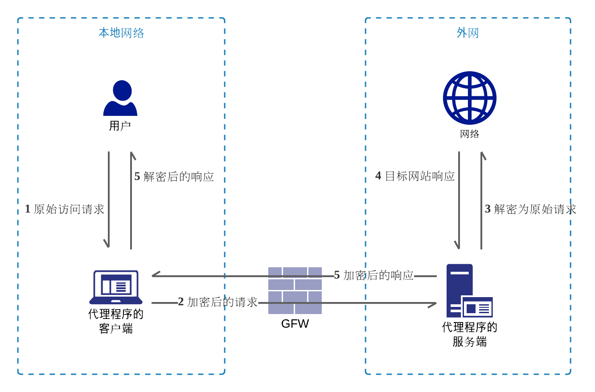
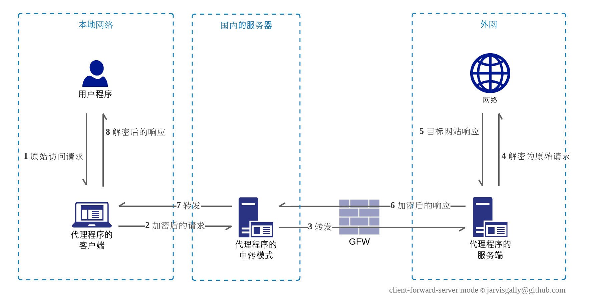

# V2Simple
该项目实现了一个简单版本的V2Ray。如果你对V2Ray等代理软件的运行机制很好奇，又没有时间研究其庞杂的实现，不妨关注此项目，核心代码不过100行，其余代码则是几个主要协议的具体实现。

目前实现了 [VMess协议](https://www.v2fly.org/developer/protocols/vmess.html) 的客户端和服务端以及一个简洁的路由，只需简单配置即可无缝对接如下配置的V2Ray客户端或者服务端：
 * [国内直连](https://guide.v2fly.org/basics/routing/cndirect.html)
 * [TLS](https://guide.v2fly.org/advanced/tls.html) 
 * [TLS分流器](https://guide.v2fly.org/advanced/tcp_tls_shunt_proxy.html) ，内建了一个简单的TLS分流器，无需额外安装 [分流器](https://github.com/liberal-boy/tls-shunt-proxy)

以下V2Ray的功能**暂不支持**：
 * VMess协议的AEAD认证以及动态端口
 * 多入口多出口路由
 * Mux/mKCP/WebSocket/H2等协议
 * 流量统计以及用户管理
 * DNS服务

接下来继续完成的功能点：
 * 支持UDP
 * 支持[VLess](https://github.com/v2ray/v2ray-core/issues/2636)

<br>

## 编译和使用

### 编译
要求 Go >= 1.14:
```shell script
git clone https://github.com/jarvisgally/v2simple
cd v2simple && go build -o bin
```

### 客户端模式
客户端模式在本地启动一个socks5代理，对流量进行加密和伪装，随后转发到Q外的服务器上：
```shell script
# 先将项目中的client.example.json复制到bin目录中，修改里面远程服务器的域名，并重命名为client.json
bin/v2simple -f client.json
```

### 服务端模式
服务器模式监听一个可以远程连接的接口，将流量还原为原始流量随后直接访问目标网站：
```shell script
# 先将项目中的server.example.json复制到bin目录中，修改里面域名证书和私钥地址，并重命名为server.json
bin/v2simple -f server.json
```

### 配置文件
客户端模式`client.example.json`：
```json
{
  "local": "socks5://127.0.0.1:1081",
  "route": "whitelist",
  "remote": "vmesss://a684455c-b14f-11ea-bf0d-42010aaa0003@<fix-me>:443?alterID=4"
}
```
服务端模式`server.example.json`：
```json
{
  "local": "vmesss://a684455c-b14f-11ea-bf0d-42010aaa0003@0.0.0.0:443?alterID=4&cert=<fix-me>&key=<fix-me>",
  "remote": "direct://"
}
```

其中`local`项标识本地服务的协议，`remote`项标识远端服务器的协议，目前支持的协议：
 * `socks5`：仅服务端，用于监听本地的socks5代理请求
 * `direct`：直连
 * `vmess`：支持客户端和服务端
 * `vmesss`：使用tls的vmess，同样支持客户端和服务端，服务端还需要额外指定域名的证书和私钥地址

注：纯vmess的协议是是基于TCP的，不推荐裸奔；在例子中我们均使用了`vmesss`，即伪装成常规的https流量；这需要预先注册一个域名并申请TLS证书，具体做法可以参考[这里](https://guide.v2fly.org/advanced/tls.html) 。

`route`项表示路由模式，目前支持如下模式：
 * `whitelist`：白名单模式，如果匹配，则直接访问，否则通过代理访问
 * `blacklist`：黑名单模式，如果匹配，则通过代理访问，否则直接访问
 * 空白：不做匹配，全部流量通过代理访问

目前项目中仅包含`whitelist`，每一行是一个域名、IP或者CIDR，来自V2Ray的`geosite:cn`、`geoip:cn`和`geoip:private`。

<br>

## FQ原理和VMess协议

FQ技术则通过加密和伪装等方案突破网络审查，目前普遍采用的方式都是客户端-服务端的方式；在客户端也就是用户自己的机器上，在流量进入互联网之前，对流量进行加密和伪装，从而穿透Q的层层审查，然后在服务端还原为原始的流量访问目标网站；服务端必须是Q外的服务器，如下图所示：



由于用户的网络环境五花八门，而且国际出口拥堵的时候会对一般线路降权处理，因此不少FQ服务商会在国内增加一个BGP节点进行中转；如，长城宽带没有自己的国际出口，是向电信和联通租用的国际出口，会限制访问国外网站的速度和稳定性（我个人经验是有可能限制在2Mbps下），通过国内中转节点的话就能避免这个问题。

现在也有不少号称国际专线的方案，亮点在于国内外节点是通过一条物理专线进行直连，完全不会被受到审查；专线原本是服务于跨国企业的，非常贵并且需要持有资质；成本在那，就必然有超卖的情况，而且企业专线和机场混在一起做，最大概率就是普通客户出事，导致企业客户一起连带不能用；是成本和风险都比较高的解决方案。

中转方案如下图所示：



V2Ray灵活的配置使得其能够胜任上述的各种情况，比如多入口多出口路由就尤其适用于中转服务器，内建多种协议配合使用也能够满足各种用户需求和多样的网络环境，[VMess协议](https://www.v2fly.org/developer/protocols/vmess.html) 是V2Ray的原创协议，主要解决了两个问题：
 * 用户的鉴权
 * 数据的加密

本质上是对流量增加了一层编解码的逻辑，在Q看来是未知协议的TCP连接，此乃最大特征，至少在敏感时期就可以轻易被Q阻断，因此一般建议配合TLS或者WS来使用。

此处简述 [VMess协议](https://www.v2fly.org/developer/protocols/vmess.html) 中的「标准格式」的数据传输方式，即指令部分的Opt为0x01时的处理方式：

 1. 客户端将原始的请求加密为 **认证信息** + **指令部分** + **数据部分**
    1. **认证信息**为16字节，使用用户id和时间戳生成，服务端通过此认证信息匹配用户，并且判断是否存在来自Q的 [重放攻击](https://github.com/v2ray/v2ray-core/issues/2523)
    1. **指令部分**比较复杂，主要包含：
       1. `响应认证` - 服务端使用此认证作为头部将加密后的响应数据返回
       1. 原始请求的协议和目标地址 - 服务端以此访问目标地址
       1. **数据部分**的对称加密算法和相关密码 - 服务端以此解密请求数据，并以同样的参数加密响应数据
       1. 将整个**指令部分**加密
    1. **数据部分**包含：
       1. 实际的请求数据被分割为若干个小块，每个小块由2个字节的长度和数据包组成
       1. 每个数据包都会使用**指令部分**的相关参数进行加密
 2. 服务端接受到请求
    1. 校验请求的**认证信息**
       1. 检测用户是否存在
       1. 处理重放攻击等
    1. 如果认证通过，解密**指令部分**可获得：
       1. `响应认证`
       1. 原始请求的协议和目标地址
       1. **数据部分**的解密方法
    1. 解密**数据部分**，并以此访问目标网站
    1. 对目标网站的响应数据进行加密，生成加密后的响应数据包，主要包括：
       1. `响应认证`
       1. 使用与请求同样的方法加密后的响应数据
 3. 客户端接收到加密后响应数据
    1. 校验`响应认证`
    1. 使用与请求一样的数据解密响应数据，并返回给浏览器
   
上述1.i的**认证信息**生成方式如下，为16字节的hash值：

```
H = MD5
K = 用户ID
M = UTC时间，精确到秒，取值为当前时间的前后30秒随机值
Hash = HMAC(H, K, M)
```

服务端会运行一个协程，不断的对已经注册的用户id生成前后120秒内的所有hash值，以此校验认证信息是合法的，这也是V2Ray要求客户端和服务器的时间不能有太大误差的原因。
   
上述1.ii的**指令部分**格式如下：

| 1 字节 | 16 字节 | 16 字节 | 1 字节 | 1 字节 | 4 位 | 4 位 | 1 字节 | 1 字节 | 2 字节 | 1 字节 | N 字节 | P 字节 | 4 字节 |
|:-:|:-:|:-:|:-:|:-:|:-:|:-:|:-:|:-:|:-:|:-:|:-:|:-:|:-:|
| 版本号 Ver | 数据加密 IV | 数据加密 Key | 响应认证 V | 选项 Opt | 余量 P | 加密方式 Sec | 保留 | 指令 Cmd | 端口 Port | 地址类型 T | 地址 A | 随机值 | 校验 F |

上述1.iii的**数据部分**被分割成小块，每一个块的数据格式如下，其中数据包由指定的加密算法加密：

| 2 字节 | L 字节 |
|:------:|:-----:|
| 长度 L | 数据包 |

<br>

## 核心代码

V2Ray的调用栈大致如下，层层叠叠的调用导致代码比较复杂，此处仅供参考：
```
+ InboundHandler.Start() - 入口启动
+   Worker.Start() - 启动TCP和UDP监听，并持续等待连接
+     Server.Process()
+       Server.processTCP() & Server.handleUDPPayload() - 处理连接
+       Server.transport() - 传输逻辑
+         DefaultDispatcher.Dispatch() - 路由逻辑
+           OutboundHandler.Dispatch() - 根据路由设置匹配到不同的出口
+             Client.Process() - 连接远端并转发流量
```

作为对比，V2Simple的核心逻辑都在`main.go`中，通过三个go关键字，比较简单的就实现了支持多个连接的流量转发逻辑：
```
+ 启动TCP监听 - net.Listen
+   持续等待连接 - go for listener.accept
+     处理连接 - go server.handshake -> route -> client.handshake
+       转发 - go io.copy
```

具体代码如下：
```go
// 开启本地的TCP监听
listener, err := net.Listen("tcp", localServer.Addr())
if err != nil {
    log.Printf("can not listen on %v: %v", localServer.Addr(), err)
    os.Exit(-1)
}
log.Printf("%v listening TCP on %v", localServer.Name(), localServer.Addr())
go func() {
    for {
        lc, err := listener.Accept()
        if err != nil {
            errStr := err.Error()
            if strings.Contains(errStr, "closed") {
                break
            }
            log.Printf("failed to accepted connection: %v", err)
            if strings.Contains(errStr, "too many") {
                time.Sleep(time.Millisecond * 500)
            }
            continue
        }
        go func() {
            defer lc.Close()
            var client proxy.Client

            // 不同的服务端协议各自实现自己的响应逻辑, 其中返回的地址则用于匹配路由
            // 常常需要额外编解码或者流量统计的功能，故需要给lc包一层以实现这些逻辑，即wlc
            wlc, targetAddr, err := localServer.Handshake(lc)
            if err != nil {
                log.Printf("failed in handshake from %v: %v", localServer.Addr(), err)
                return
            }

            // 匹配路由
            if conf.Route == whitelist { // 白名单模式，如果匹配，则直接访问，否则使用代理访问
                if matcher.Check(targetAddr.Host()) {
                    client = directClient
                } else {
                    client = remoteClient
                }
            } else if conf.Route == blacklist { // 黑名单模式，如果匹配，则使用代理访问，否则直接访问
                if matcher.Check(targetAddr.Host()) {
                    client = remoteClient
                } else {
                    client = directClient
                }
            } else { // 全部流量使用代理访问
                client = remoteClient
            }
            log.Printf("%v to %v", client.Name(), targetAddr)

            // 连接远端地址
            dialAddr := remoteClient.Addr()
            if _, ok := client.(*direct.Direct); ok { // 直接访问则直接连接目标地址
                dialAddr = targetAddr.String()
            }
            rc, err := net.Dial("tcp", dialAddr)
            if err != nil {
                log.Printf("failed to dail to %v: %v", dialAddr, err)
                return
            }
            defer rc.Close()

            // 不同的客户端协议各自实现自己的请求逻辑
            wrc, err := client.Handshake(rc, targetAddr.String())
            if err != nil {
                log.Printf("failed in handshake to %v: %v", dialAddr, err)
                return
            }

            // 流量转发
            go io.Copy(wrc, wlc)
            io.Copy(wlc, wrc)
        }()
    }
}()
```

<br>

## 参考

该项目参考了如下资源：
 * [你也能写个 Shadowsocks](https://github.com/gwuhaolin/blog/issues/12) ，当前项目参考了里面关于SOCKS5协议的实现；如果标题党一下，本文或许也可改为「你也能撸一个 V2Ray」吧
 * [Clash](https://github.com/Dreamacro/clash) ，VMess的客户端部分
 * [V2Ray](https://github.com/v2fly/v2ray-core)